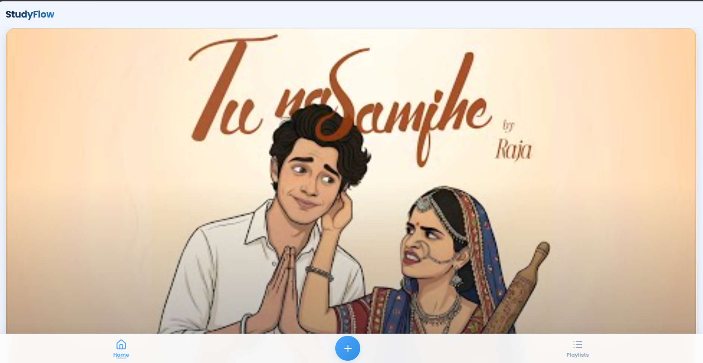
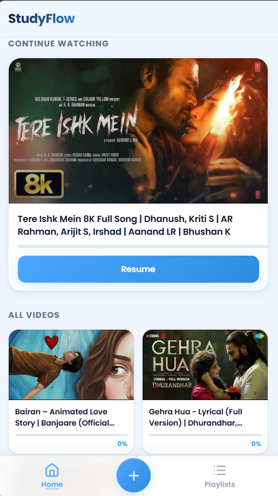

<div align="center">


# StudyFlow

### Distraction-Free YouTube Learning App

<p align="center">
  <a href="https://ayusheduverse.github.io/Study-Flow/">
    
  </a>
  <a href="https://github.com/AyushEduverse/Study-Flow">
    
  </a>
</p>

<p align="center">
  <strong>
    Save YouTube videos, organize them in playlists, take timestamped notes, and watch with auto-resume —<br>
    all in a clean, distraction-free interface.
  </strong>
</p>

<p align="center">
  <a href="https://ayusheduverse.github.io/Study-Flow/">🌐 Live Demo</a> •
  <a href="#-features">Features</a> •
  <a href="#-quick-start">Quick Start</a> •
  <a href="#-project-structure">Structure</a> •
  <a href="#-tech-stack">Tech Stack</a> •
  <a href="#-screenshots">Screenshots</a>
</p>

</div>

---

## ✨ Features

### Core
- **🎥 Save YouTube Videos** — Paste any YouTube link; title & thumbnail are auto-fetched via oEmbed
- **📂 Organize in Playlists** — Create, rename, delete playlists; assign videos to keep your learning structured
- **▶️ Distraction-Free Player** — Full YouTube IFrame Player API with programmatic controls (play, pause, seek, volume)
- **📝 Timestamped Notes** — Add notes at any point in a video; click a note to seek directly to that moment
- **🔍 Live Search** — Instant letter-by-letter filtering of your video library — no debounce, no delay
- **⏱️ Auto-Resume** — Progress auto-saves every 5 seconds + on pause/tab switch/close; resumes from exact position
- **⏸️ Smart Pause** — Video auto-pauses when you switch tabs, minimize the window, or close the app
- **✅ Auto-Complete** — Videos automatically marked as complete at 95%+ progress

### Gesture & Touch
- **👆 Swipe to Go Back** — Swipe right from anywhere on the player screen to return home
- **↩️ Floating Back Button** — Tap the player area to reveal a floating back button with auto-hide
- **📱 Haptic Feedback** — Subtle vibration on video card tap and complete-mark actions (mobile)
- **✨ Swipe Hint** — First-time visitors see a subtle left-edge pulse animation showing the swipe gesture
- **🤚 Enhanced Touch** — Press-scale animations, `overscroll-behavior` prevention, momentum scrolling on iOS

### PWA & Offline
- **📲 Installable** — Add to home screen as a standalone PWA app
- **🔌 Offline Support** — Full app shell cached via Service Worker; works without network
- **🔄 Smart Updates** — Dual detection via `version.json` polling + SW lifecycle; in-app "Update Now" modal
- **🔒 Safe Updates** — Auto-backup of all data (videos, playlists, notes) before every update; automatic restore if data is lost
- **📦 Local Lucide Icons** — Icon library bundled locally — no CDN dependency, works fully offline

### Accessibility
- **♿ ARIA Labels** — All interactive elements have descriptive aria labels
- **⌨️ Keyboard Navigable** — Full keyboard support with visible focus indicators
- **🔊 Screen Reader** — Dynamic content announcements for screen readers
- **🎨 Reduced Motion** — `prefers-reduced-motion` disables animations, transitions, and skeleton loaders
- **🌓 Color Contrast** — Sufficient contrast ratios throughout

### Performance
- **💨 Skeleton Loaders** — Instant perceived load with skeleton screens matching real content layout
- **⚡ Smooth Animations** — CSS-driven transitions with `will-change` and GPU-accelerated properties
- **📦 Zero Dependencies** — Pure vanilla JavaScript — no frameworks, no build step, no bundler

## 🚀 Quick Start

No installation or build step needed. Just open `index.html` in any modern browser!

```bash
# Clone the repository
git clone https://github.com/AyushEduverse/Study-Flow.git

# Navigate into the project
cd Study-Flow

# Open directly in browser
open index.html
# or just double-click index.html!
```

> 💡 **Tip:** All data is stored in your browser's LocalStorage. Nothing is sent to any server — your data stays completely private.

## 📁 Project Structure

```
Study-Flow/
├── index.html              ← Single HTML file, all screens (Home, Player, Playlists)
├── assets/
│   ├── icons/              ← App icons (favicon, PWA icons, logo)
│   └── screenshots/        ← README screenshots
├── css/
│   ├── main.css            ← Design system, reset, bottom nav, skeleton loaders, accessibility
│   ├── home.css            ← Home screen (continue watching, video grid, live search)
│   ├── player.css          ← Player screen (YT player, progress, swipe gesture)
│   ├── playlists.css       ← Playlists screen (cards, kebab menu, filtered view)
│   ├── modal.css           ← Modal/bottom sheet, custom dropdown, confirm dialog
│   ├── updater.css         ← PWA update modal styles
│   └── notes.css           ← Timestamped notes UI
├── js/
│   ├── storage.js          ← LocalStorage CRUD + in-memory cache + backup/restore + toast
│   ├── router.js           ← SPA screen switching + skeleton show/hide + nav
│   ├── home.js             ← Home screen render + continue watching + live search
│   ├── player.js           ← YouTube IFrame API + progress auto-save + swipe gestures
│   ├── playlists.js        ← Playlist CRUD, kebab menu, filtered view, dropdowns
│   ├── modal.js            ← Add/Edit video modal + oEmbed fetch + confirm dialog
│   ├── notes.js            ← Timestamped notes: create, seek, delete
│   └── updater.js          ← PWA update detection & in-app update modal
├── lib/
│   └── lucide.min.js       ← Local Lucide icon library (no CDN needed)
├── docs/
│   └── superpowers/
│       └── plans/          ← Feature planning documents
├── sw.js                   ← PWA Service Worker (cache strategies: static, CDN, dynamic)
├── version.json            ← App version for update polling
├── site.webmanifest        ← PWA manifest
└── README.md               ← You are here
```

## 🛠️ Tech Stack

| Technology | Purpose |
|:---:|:---|
|  | Semantic structure with ARIA accessibility throughout |
|  | Modern layout with CSS custom properties + smooth animations |
|  | Pure vanilla JS — no frameworks, no build step |
|  | IFrame Player API for full playback control |
|  | All data stored client-side — private & offline-ready |
|  | Service Worker caching + installable app manifest |
|  | Local SVG icons (no CDN dependency) |

## 📸 Screenshots

<div align="center">
  

  
</div>

---

## 🎯 How It Works

1. **Add a video** — Tap the **+** button and paste a YouTube link
2. **Auto-fetch** — Title and thumbnail are fetched instantly via oEmbed API
3. **Organize** — Assign videos to playlists you create or edit later
4. **Watch & Learn** — Click any video to open the distraction-free player
5. **Take Notes** — Tap **Add Note** while watching to save timestamped bookmarks; click any note to seek to that moment
6. **Auto-Resume** — Progress saves every 5 seconds + on pause/tab switch/close; resumes from exact position
7. **Smart Pause** — Video pauses automatically when you leave the app; resumes when you return
8. **Search** — Use the live search bar on the home screen to instantly filter your library
9. **Auto-Complete** — Videos are automatically marked as complete when you reach 95% progress

## 📲 PWA / Install

StudyFlow is a Progressive Web App. You can install it on your device:

1. Open StudyFlow in Chrome, Edge, or Safari
2. Tap the **Install** button in the address bar, or use the browser menu → **Add to Home Screen**
3. Once installed, it works offline — all your data is stored locally in your browser

### Update Safety

StudyFlow has a built-in safe-update mechanism:

- **Auto-backup** — Your videos, playlists, and notes are automatically backed up every time you switch tabs, close the app, or before a PWA update
- **Auto-restore** — If data is ever lost during an update, it's automatically restored from the latest backup on the next page load
- **Update Modal** — When a new version is available, you'll see an in-app modal. Tap **Update Now** to safely upgrade with zero data loss

## ♿ Accessibility

- **Semantic HTML5** with ARIA labels, roles, and live regions throughout
- **Keyboard-navigable** — All actions accessible via Tab, Enter, and Escape
- **Focus-visible indicators** on every interactive element
- **Screen reader announcements** for dynamic content via `aria-live`
- **Reduced motion** — `prefers-reduced-motion` media query disables all animations, transitions, and skeleton effects
- **High contrast** — Sufficient color contrast ratios (>= 4.5:1) for all text
- **Touch-friendly** — Minimum 44×44px tap targets, `-webkit-tap-highlight-color: transparent`

## 📄 License

This project is open source. Feel free to use, modify, and share.

---

<div align="center">

Built with ❤️ by Starverse [Ayush Gupta]

</div>
